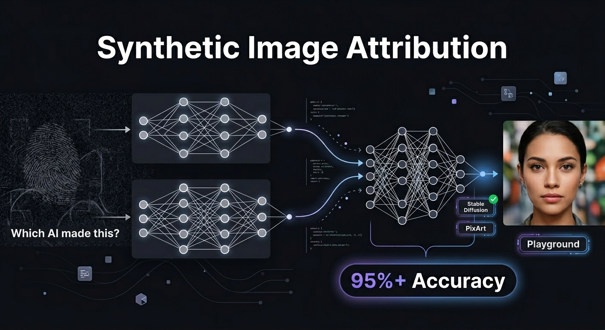

# Synthetic Image Attribution



A deep learning pipeline for synthetic image source attribution — classifying AI-generated face images across 10 text-to-image models. Built for the **ICANN 2026 DLMMDD Workshop Challenge**.

**Public Leaderboard Accuracy: 95%+**

---

## Problem

Given a synthetic face image, identify which of 10 text-to-image models generated it. Each generative model leaves invisible statistical traces — noise patterns, frequency artifacts, color signatures — that a trained model can learn to detect.

The 10 sources are: AuraFlow, Freepik, Lumina, Photon, PixArt-Sigma, Playground v2.5, StableDiffusion3, StableDiffusion3.5, StableDiffusionXL-Turbo, and Tencent Hunyuan.

---

## Architecture

### Dual-Stream Model

Two EfficientNet-B4 backbones run in parallel. Their feature vectors are concatenated and passed to a classification head.

```
Input Image
    │
    ├──► EfficientNet-B4 (RGB stream)     ──► features (1792-d)
    │                                                           ├──► Linear(3584, 512) ──► Linear(512, 10)
    └──► SRMConv ──► EfficientNet-B4 (noise stream) ──► features (1792-d)
```

**Stream 1 — RGB** processes the raw image and learns visual and color-based fingerprints.

**Stream 2 — SRM Noise** applies three fixed Spatial Rich Model filters before the backbone. These are forensic high-pass filters that extract noise residuals — artifacts invisible to the human eye but unique to each generative model.

### Why SRM?

Standard augmentation pipelines (ColorJitter, rotations) can destroy the forensic features that distinguish one model from another. SRM filters isolate exactly those features, giving the model a dedicated channel to learn from.

---

## Results

| Split | Accuracy |
|-------|----------|
| Validation | ~98.5% |
| Public Leaderboard (50% test) | 95%+ |

The gap between val and test is expected — the test set has random post-processing applied (JPEG compression, blur, grayscale, rotation, resizing) that the val set does not.

---

## Pipeline

```
1. EDA                    — class distribution, image sizes, visual inspection
2. Preprocessing          — resize to 384×384, ImageNet normalization
3. Augmentation           — HorizontalFlip, RandomGrayscale(p=0.1), light ColorJitter
4. Dataset & DataLoader   — stratified 80/20 train-val split
5. Model                  — DualStreamModel (EfficientNet-B4 × 2 + SRMConv)
6. Training               — AdamW + OneCycleLR + Mixed Precision + Early Stopping
7. Inference              — TTA (5 augmented views averaged per image)
8. Submission             — submission.csv
```

---

## Training Details

| Parameter | Value |
|-----------|-------|
| Backbone | EfficientNet-B4 (pretrained ImageNet) |
| Input Size | 384 × 384 |
| Batch Size | 64 |
| Optimizer | AdamW (weight_decay=1e-3) |
| Learning Rate | 1e-4 (OneCycleLR) |
| Epochs | 20 (early stopping, patience=5) |
| Mixed Precision | ✅ torch.amp |
| TTA augments | 5 |

---

## Project Structure

```
synthetic-image-attribution/
├── assets/
│   └── cover.png
├── Synthetic_Image_Classification.ipynb   # full pipeline
└── README.md
```

---

## Key Lessons

**Less augmentation is better here.** Aggressive ColorJitter and rotation can erase the subtle noise patterns that distinguish generative models. Keeping augmentation light improved val accuracy significantly.

**SRM filters matter.** Adding the forensic noise stream gave a consistent boost over a single RGB backbone — the two streams capture complementary information.

**TTA helps on post-processed images.** The test set has random degradation applied. Averaging over 5 slightly different augmented views reduces prediction variance on these degraded inputs.

---

## Competition

[DLMMDD Workshop: Synthetic Image Attribution — ICANN 2026](https://kaggle.com/competitions/dlmmdd-workshop-synthetic-source-attribution-challenge)

> Andrea Montibeller, Barbara Corradini, Pietro Bongini, Sara Mandelli, and Simone Bonechi. DLMMDD Workshop: Synthetic Image Attribution. Kaggle, 2026.